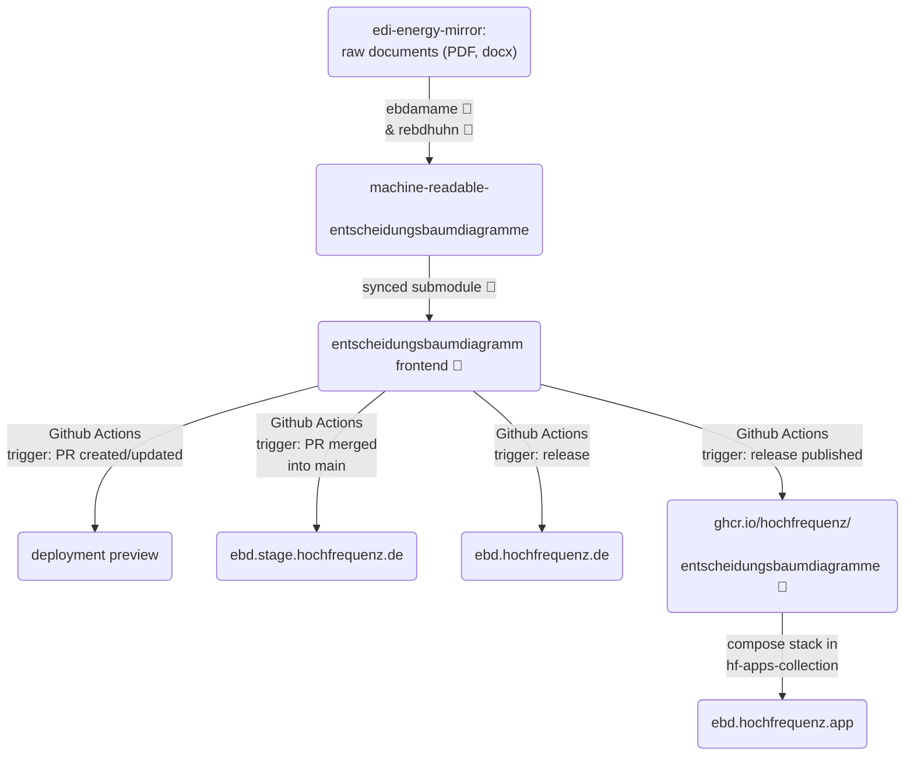

# EBD.HOCHFREQUENZ.DE


### ⚙️ Setting up development environment

Make sure you have the latest version of [node](https://nodejs.org/en) installed (recommended via node version manager [nvm](https://github.com/nvm-sh/nvm)).

```sh
$ npm install
```

```sh
$ npm run start # starts local dev server (including hot reload)
$ npm run lint # lints the whole project (eslint)
$ npm run format # formats the whole project (prettier)
```

To serve the built site locally, run

```sh
$ npm run serve
```

```sh
$ npm run build && npx http-server ./build
```

This starts an HTTP server at http://127.0.0.1:8080, providing a local view roughly equivalent to how Azure will render the project.

### 🏷️ Semantic commit messages

To meet the pull request title convention [requirements](https://github.com/Hochfrequenz/entscheidungsbaumdiagramm/blob/main/.github/workflows/conventional-commit-validation.yml) enforced by Github Actions, here is a brief guide to help choosing the appropriate tag for each purpose:

- `build:` - changes that affect the build system or external dependencies
- `chore:` - miscellaneous commits and routine tasks
- `ci:` - changes to the CI/CD configuration
- `docs:` - updating the documentation
- `feat:` - adding or removing a feature feature
- `fix:` - bug fixes
- `perf:` - performance improvement
- `refactor:` - improve code structure, readability, or maintainability
- `revert:` - reverts a previous commit
- `style:` - code formatting and styling that do not affect functionality
- `test:` - adding or updating tests

### 🏛 Architecture


```mermaid
flowchart TD
    A("edi-energy-mirror:
    raw documents (PDF, docx)") -->|ebdamame 🫛
    & rebdhuhn 🐥| B("machine-readable-
    entscheidungsbaumdiagramme")
    B -->|synced submodule 🔄| C("entscheidungsbaumdiagramm frontend 🌳")
    C -->|Github Actions
    trigger: PR created/updated| D("deployment preview")
    C -->|Github Actions
    trigger: PR merged
    into main| E("ebd.stage.hochfrequenz.de")
    C -->|Github Actions
    trigger: release| F("ebd.hochfrequenz.de")
    C -->|Github Actions
    trigger: release published| G("ghcr.io/hochfrequenz/
    entscheidungsbaumdiagramme 🐳")
    G -->|compose stack in
    hf-apps-collection| H("ebd.hochfrequenz.app")
```

> A GitHub **release** now produces two things: the Azure Static Web App deployment as before, and a
> container image on GHCR that the self-hosted
> [hf-apps-collection](https://github.com/Hochfrequenz/hf-apps-collection) platform deploys. Both run
> in parallel until the migration off Azure is finished.

### 🔐 Auth0 authentication

> [!NOTE]
> During local development, authentication is currently not required. Instead, a dummy account `local@development.com` will be already logged in at both local dev server startup as well as build preview.

To get past the landing page when navigating through the staging environment [`https://ebd.stage.hochfrequenz.de`](https://ebd.stage.hochfrequenz.de) and production environment [`https://ebd.hochfrequenz.de`](https://ebd.hochfrequenz.de), users need to authenticate using their Hochfrequenz login credentials.

### 🔗 Links

[Marktgut](https://hochfrequenz-marktplatz.atlassian.net/browse/HFMP-67)<br>
[Azure](https://portal.azure.com/#@hochfrequenz.net/resource/subscriptions/1cdc65f0-62d2-4770-be11-9ec1da950c81/resourceGroups/entscheidungsbaumdiagramm/providers/Microsoft.Web/staticSites/entscheidungsbaumdiagramm-frontend-stage/staticsite)

[ebdamame](https://github.com/Hochfrequenz/ebdamame)<br>
[rebdhuhn](https://github.com/Hochfrequenz/rebdhuhn)<br>
[EBD toolchain](https://github.com/Hochfrequenz/ebd_toolchain)<br>
[machine-readable EBDs](https://github.com/Hochfrequenz/machine-readable_entscheidungsbaumdiagramme/)

[BDEW](https://www.edi-energy.de/index.php?id=38&tx_bdew_bdew%5Bview%5D=future&tx_bdew_bdew%5Baction%5D=list&tx_bdew_bdew%5Bcontroller%5D=Dokument&cHash=325de212fe24061e83e018a2223e6185)

### 🐳 Container image

This app is deployed as a container on the self-hosted
[hf-apps-collection](https://github.com/Hochfrequenz/hf-apps-collection) platform, alongside its
Azure Static Web App deployment.

**Releases are cut by publishing a GitHub release**, not by pushing a bare tag. The release's
_pre-release_ checkbox decides the channel: ticked means a staging image, unticked means production
and moves `latest`. The formatting, linting and build/e2e workflows must pass first — a release cut
from an unprotected branch cannot skip them. The workflow prints the image digest to pin in the
deployment repo.

Image: `ghcr.io/hochfrequenz/entscheidungsbaumdiagramme`.

```sh
$ git tag v1.2.3 && git push origin v1.2.3       # release
$ git submodule update --init --recursive        # needed before building locally
$ docker build -t ebd .
$ docker run --rm -p 8080:8080 \
    -e APP_AUTH0_CLIENT_ID=<client-id> ebd
```

**Configuration is injected at runtime**, not baked into the bundle: the entrypoint writes
`/config.js` from `APP_*` environment variables and the app reads `window.__APP_CONFIG__`, falling
back to the build-time `VITE_AUTH0_CLIENT_ID` value. That is why one image serves both staging and
production, and why `npm run dev` and Cloudflare Pages previews keep working unchanged.

> Note: the image is built **without** `VITE_AUTH0_CLIENT_ID`, so inside the container there is no
> build-time fallback — if `APP_AUTH0_CLIENT_ID` is missing, login is simply broken. The compose
> stack declares it as required, so a real deployment fails before starting.
>
> When testing locally on `localhost`, `auth_config.ts` treats the app as being in dev mode and
> forces an empty client ID, so the runtime value cannot be exercised through a plain
> `localhost:8080` — reach the container under a non-localhost hostname to test it.

| File                           | Purpose                                                |
| ------------------------------ | ------------------------------------------------------ |
| `Dockerfile`                   | two-stage build: node 20 → nginx                       |
| `docker/nginx.conf`            | serving rules                                          |
| `docker/entrypoint.sh`         | renders `/config.js` from the environment              |
| `docker/security-headers.conf` | headers included into every location that sets its own |
