# EBD.HOCHFREQUENZ.DE


### ⚙️ Setting up development environment

Make sure you have the latest version of [node](https://nodejs.org/en) installed (recommended via node version manager [nvm](https://github.com/nvm-sh/nvm)).

```sh
$ npm install
```

```sh
$ npm run start # starts local dev server (including hot reload)
$ npm run lint # lints the whole project (eslint)
$ npm run format # formats the whole project (prettier)
$ npm run test # runs E2E tests (playwright) assuming the dev server is up and running
```

To serve the built site locally, run

```sh
$ npm run build && npx http-server ./build
```

This starts an HTTP server at http://127.0.0.1:8080, providing a local view roughly similar to how Azure will render the project.

### 🏷️ Semantic commit messages

To meet the pull request title convention [requirements](https://github.com/Hochfrequenz/entscheidungsbaumdiagramm/blob/main/.github/workflows/conventional-commit-validation.yml) enforced by Github Actions, here is a brief guide to help choosing the appropriate tag for each purpose:

- `build:` - changes that affect the build system or external dependencies
- `chore:` - miscellaneous commits and routine tasks
- `ci:` - changes to the CI/CD configuration
- `docs:` - updating the documentation
- `feat:` - adding or removing a feature feature
- `fix:` - bug fixes
- `perf:` - performance improvement
- `refactor:` - improve code structure, readability, or maintainability
- `revert:` - reverts a previous commit
- `style:` - code formatting and styling that do not affect functionality
- `test:` - adding or updating tests

### 🏛 Architecture

```mermaid
flowchart TD
    A("edi-energy-mirror:
    raw documents (PDF, docx)") -->|ebdamame 🫛
    & rebdhuhn 🐥| B("machine-readable-
    entscheidungsbaumdiagramme")
    B -->|synced submodule 🔄| C("entscheidungsbaumdiagramm frontend 🌳")
    C -->|Github Actions| D("ebd.stage.hochfrequenz.de")
    C -->|Github release| E("ebd.hochfrequenz.de")
```



### 🔐 Auth0 authentication

> [!NOTE]
> During local development, authentication is currently not required. Instead, a dummy account `local@development.com` will be already logged in at both local dev server startup as well as build preview.

To get past the landing page when navigating through the staging environment `https://ebd.stage.hochfrequenz.de` and production environment `https://ebd.hochfrequenz.de`, users need to authenticate using their Hochfrequenz login credentials.
